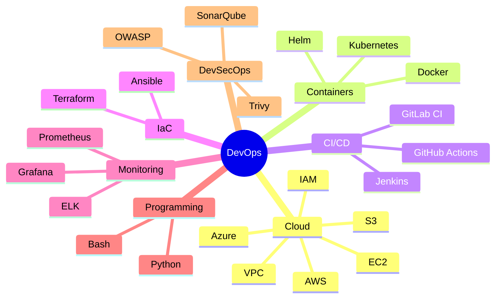
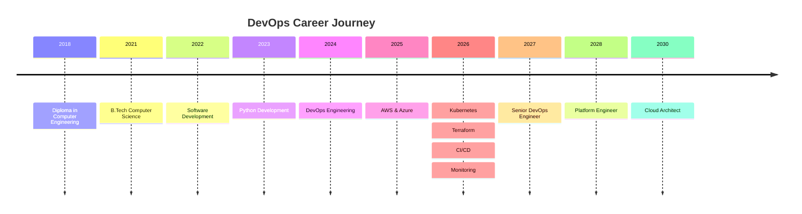

<div align="center">

# 👋 Hi, I'm Ashok Swami


</div>

<div align="center">

<a href="https://github.com/Ashok-Swami">

</a>

<a href="https://www.linkedin.com/in/ashok-swami/">

</a>

<a href="mailto:ashokswami1137@gmail.com">

</a>

</div>

<div align="center">


</div>

---

# 💻 DevOps Engineer

I'm a passionate **DevOps Engineer** with 5+ years of experience designing, automating, and managing scalable cloud infrastructure.

I specialize in:

- ☁️ AWS Cloud
- 🔷 Microsoft Azure
- ☸ Kubernetes
- 🐳 Docker
- 🌍 Terraform
- 🔄 Jenkins
- ⚡ GitHub Actions
- 🐧 Linux
- 🐍 Python Automation
- 📊 Prometheus & Grafana

---


> **"Automate Everything. Monitor Everything. Improve Continuously."**

<div align="center">


</div>

---

#  About Me


I'm **Ashok Swami**, a passionate **DevOps Engineer** with **5+ years of experience** in Software Development, Cloud Infrastructure, Automation, and CI/CD.

I enjoy building highly available, scalable, and secure cloud-native applications while automating infrastructure using **Infrastructure as Code (IaC)**.

I have hands-on experience with AWS, Azure, Kubernetes, Docker, Terraform, Jenkins, GitHub Actions, Linux Administration, Monitoring, and Python Automation.

I'm passionate about learning modern DevOps technologies and continuously improving deployment automation, security, and cloud architecture.

<br>

- 🔭 Currently working as **DevOps Engineer**
- 🌱 Currently learning **Advanced Kubernetes, Kafka, GitOps & Platform Engineering**
- ☁️ Working on **AWS & Azure Cloud Infrastructure**
- 💬 Ask me about **AWS, Docker, Kubernetes, Terraform, Linux, Jenkins, GitHub Actions & Python**
- 🎯 Goal: **Become a Senior DevOps / Platform Engineer**
- ⚡ Fun fact: **I love automating repetitive tasks using Python and Bash.**

---

# 👨‍💻 Professional Summary

DevOps Engineer with **5+ years of professional experience** in designing, implementing, and maintaining scalable cloud infrastructure and CI/CD pipelines.

Experienced in:

- ☁️ AWS Cloud Services
- ☁️ Microsoft Azure
- ☸ Kubernetes
- 🐳 Docker
- 🌍 Terraform
- 🔄 Jenkins
- ⚡ GitHub Actions
- 🐧 Linux Administration
- 🐍 Python Automation
- 📊 Prometheus & Grafana
- 📦 Kafka
- 🛡 Infrastructure Security

Strong understanding of Infrastructure as Code (IaC), container orchestration, cloud networking, monitoring, automation, and DevOps best practices.

---

# 🎯 Current Focus

<table>
<tr>

<td width="33%" align="center">

## ☁️ Cloud

AWS

GCP

Azure

Cloud Security

Infrastructure

</td>

<td width="33%" align="center">

## 🚀 DevOps

Docker

Kubernetes

Terraform

GitHub Actions

Jenkins

</td>

<td width="33%" align="center">

## 📈 Monitoring

Prometheus

Grafana

ELK

AlertManager

Kafka

</td>

</tr>
</table>

---

# 🌍 Career Objective

> I aim to build reliable, secure, and scalable cloud platforms that empower development teams to deliver software faster through automation, Infrastructure as Code, and DevOps best practices.

---

# 💡 Core Expertise

| Area | Technologies |
|------|--------------|
| Cloud | AWS, Azure, GCP |
| Containers | Docker, Kubernetes |
| CI/CD | Jenkins, GitHub Actions |
| IaC | Terraform |
| Monitoring | Prometheus, Grafana |
| Programming | Python, Bash |
| Databases | MySQL, PostgreSQL, MongoDB |
| Messaging | Kafka, RabbitMQ |
| Web Servers | Nginx, Apache |
| Operating Systems | Linux, Ubuntu, CentOS |


---

# 🛠️ Tech Stack

<div align="center">

## ☁️ Cloud Platforms

<p>


</p>

---

## 🚀 DevOps & CI/CD

<p>


</p>

---

## 💻 Programming

<p>


</p>

---

## 🖥️ Operating Systems

<p>


</p>

---

## 🗄️ Databases

<p>


</p>

---

## 📊 Monitoring & Logging

<p>


</p>


---

## 🌐 Web Servers

<p>


</p>

---

## 🔧 Tools

<p>


</p>

---

## 📦 Messaging


---

</div>

---

---

# 📊 Skill Matrix

| Technology | Experience | Level |
|------------|------------|--------|
| AWS | ⭐⭐⭐⭐⭐ | Advanced |
| Azure | ⭐⭐⭐⭐☆ | Intermediate |
| Docker | ⭐⭐⭐⭐⭐ | Advanced |
| Kubernetes | ⭐⭐⭐⭐☆ | Intermediate |
| Terraform | ⭐⭐⭐⭐☆ | Intermediate |
| Jenkins | ⭐⭐⭐⭐⭐ | Advanced |
| GitHub Actions | ⭐⭐⭐⭐⭐ | Advanced |
| Linux | ⭐⭐⭐⭐⭐ | Advanced |
| Python | ⭐⭐⭐⭐☆ | Intermediate |
| Bash | ⭐⭐⭐⭐☆ | Intermediate |
| Kafka | ⭐⭐⭐☆☆ | Learning |
| Prometheus | ⭐⭐⭐⭐☆ | Intermediate |
| Grafana | ⭐⭐⭐⭐☆ | Intermediate |
| MySQL | ⭐⭐⭐⭐☆ | Intermediate |
| PostgreSQL | ⭐⭐⭐⭐☆ | Intermediate |
| MongoDB | ⭐⭐⭐☆☆ | Intermediate |
| Git | ⭐⭐⭐⭐⭐ | Advanced |


---

# ❤️ Favorite Technologies

<div align="center">

| ☁️ Cloud | 🚀 DevOps | 💻 Programming |
|-----------|------------|---------------|
| AWS | Kubernetes | Python |
| Azure | Docker | Bash |
| EC2 | Terraform | FastAPI |
| S3 | Jenkins | Django |
| IAM | GitHub Actions | Flask |
| VPC | Helm | REST APIs |

</div>


---

# 🚀 Currently Working On

- ☁️ AWS Infrastructure Automation

- ☸ Kubernetes Production Deployments

- 🌍 Terraform Infrastructure as Code

- 🔄 GitHub Actions CI/CD

- 🐳 Docker Optimization

- 📊 Prometheus & Grafana Monitoring

- 📦 Kafka Production Cluster

- 🛡 DevSecOps Best Practices

- 🐍 Python Automation

---


---

# 🔄 My DevOps Workflow

```text
Developer
     │
     ▼
 GitHub Repository
     │
     ▼
 GitHub Actions
     │
     ▼
 Jenkins Pipeline
     │
     ▼
 Docker Build
     │
     ▼
 Docker Registry
     │
     ▼
 Kubernetes Cluster
     │
     ▼
 Monitoring
     │
     ▼
 Prometheus
     │
     ▼
 Grafana
```

---

---

# 💼 Professional Experience

<div align="center">

> **Building reliable cloud infrastructure through automation, scalability, and continuous improvement.**

</div>

---

## 💼 DevOps Engineer

**Kernel Equity Technologies Pvt. Ltd.**  
📍 Vadodara, Gujarat, India

**Responsibilities**

- ☁️ Managed AWS and Azure cloud infrastructure
- 🚀 Built CI/CD pipelines using Jenkins and GitHub Actions
- 🐳 Containerized applications using Docker
- ☸️ Deployed and managed Kubernetes workloads
- 🌍 Provisioned infrastructure with Terraform
- 🐧 Administered Linux production servers
- 📊 Implemented monitoring using Prometheus & Grafana
- 🔐 Managed IAM, networking, SSL certificates, and security hardening
- 🐍 Developed Bash and Python automation scripts
- 📦 Worked with Kafka and containerized microservices

---

## 👨‍💻 Software Engineer

Worked on backend application development using:

- Python
- FastAPI
- Django
- Flask
- PHP Laravel
- MySQL
- PostgreSQL
- MongoDB

Also collaborated with DevOps teams for deployments and production support.

---

# 🚀 Career Highlights

- ✅ 5+ Years of IT Experience
- ☁️ Multi-Cloud Experience (AWS & Azure)
- 🚀 CI/CD Automation
- 🐳 Docker & Kubernetes Deployments
- 🌍 Infrastructure as Code (Terraform)
- 🐧 Linux Administration
- 📊 Monitoring & Logging
- 🔐 Cloud Security Best Practices
- 🐍 Python & Bash Automation
- 📦 Kafka Administration (Learning & Hands-on)

---


# 📂 Featured Projects

| 🚀 Project | Description | Tech Stack |
|------------|-------------|------------|
| Kubernetes Production Lab | Deployments, Services, Ingress, HPA | Kubernetes |
| Terraform AWS Infrastructure | Complete AWS provisioning using IaC | Terraform, AWS |
| Jenkins CI/CD Pipeline | Automated build, test & deployment | Jenkins |
| GitHub Actions Pipeline | CI/CD workflow automation | GitHub Actions |
| Docker Enterprise Setup | Multi-container applications | Docker |
| Kafka Cluster | Messaging & event streaming | Kafka |
| Monitoring Stack | Prometheus, Grafana & AlertManager | Monitoring |
| Python Automation | Server automation & deployment scripts | Python |
| Linux Administration Toolkit | Health checks & server management | Bash |
| FastAPI Deployment | Production-ready API deployment | FastAPI, Docker |


---

# ⭐ Featured Repositories

| Repository | Description |
|------------|-------------|
| 🔥 Kubernetes-Labs | Kubernetes practice and production examples |
| ☁️ Terraform-AWS | Infrastructure as Code using Terraform |
| 🚀 Jenkins-Pipelines | CI/CD pipeline examples |
| 🐳 Docker-Labs | Dockerfiles, Compose, optimization |
| 📊 Monitoring-Stack | Prometheus + Grafana + Alertmanager |
| 🐍 Python-Automation | DevOps automation scripts |
| 📦 Kafka-Learning | Kafka installation and cluster setup |
| 🔄 GitHub-Actions | CI/CD workflows |
| ☸️ Helm-Charts | Kubernetes Helm charts |
| 🌐 Linux-Scripts | Useful Bash automation scripts |

---


# 🏆 Key Achievements

- 🚀 Automated CI/CD pipelines
- ☁️ Managed cloud infrastructure
- 🐳 Dockerized multiple applications
- ☸️ Kubernetes deployments
- 🌍 Infrastructure as Code implementation
- 📊 Centralized monitoring
- 🔐 Improved infrastructure security
- 🐧 Linux server administration
- 🐍 Automated repetitive tasks using Python & Bash
- 📈 Improved deployment reliability and efficiency

---


# 📊 Project Snapshot

| Category | Highlights |
|----------|------------|
| ☁️ Cloud Platforms | AWS, Azure |
| 🚀 CI/CD | Jenkins, GitHub Actions |
| 🐳 Containers | Docker |
| ☸️ Orchestration | Kubernetes |
| 🌍 IaC | Terraform |
| 📊 Monitoring | Prometheus, Grafana |
| 💻 Programming | Python, Bash |
| 🐧 Linux | Ubuntu, CentOS |
| 🗄️ Databases | MySQL, PostgreSQL, MongoDB |
| 📦 Messaging | Kafka, RabbitMQ |

---

---

# 📊 GitHub Analytics

<div align="center">


</div>

---
## 🔥 GitHub Streak

<div align="center">


</div>

---

## 📈 Contribution Graph

<div align="center">


</div>

---

## 📊 Profile Summary

<div align="center">


<br><br>


<br><br>


</div>

---

## 🏆 GitHub Trophies

<div align="center">


</div>

---

## 🐍 Contribution Snake

<div align="center">

<picture>

<source media="(prefers-color-scheme: dark)" srcset="https://raw.githubusercontent.com/Ashok-Swami/Ashok-Swami/output/github-contribution-grid-snake-dark.svg"/>

<source media="(prefers-color-scheme: light)" srcset="https://raw.githubusercontent.com/Ashok-Swami/Ashok-Swami/output/github-contribution-grid-snake.svg"/>


</picture>

</div>

---


## 💻 Coding Activity

<div align="center">

| Metric | Status |
|---------|--------|
| 🔥 Current Focus | DevOps & Cloud |
| ☁️ Cloud | AWS & Azure |
| 🚀 CI/CD | Jenkins & GitHub Actions |
| 🐳 Containers | Docker |
| ☸️ Orchestration | Kubernetes |
| 🌍 IaC | Terraform |
| 📊 Monitoring | Prometheus & Grafana |
| 🐍 Programming | Python & Bash |
| 📦 Messaging | Kafka |

</div>

---

## 🚀 Daily Workflow

```text
Code
   │
   ▼
GitHub
   │
   ▼
GitHub Actions
   │
   ▼
Jenkins
   │
   ▼
Docker
   │
   ▼
Kubernetes
   │
   ▼
Monitoring
   │
   ▼
Production
```

---

---

# 🎓 Certifications

<div align="center">

| Certification | Status | Target |
|:--------------|:------:|:------:|
| AWS Solutions Architect Associate (SAA-C03) | 🟡 In Progress | 2026 |
| AWS DevOps Engineer Professional | 🔵 Planned | 2027 |
| Microsoft Azure Administrator (AZ-104) | 🟡 In Progress | 2026 |
| Certified Kubernetes Administrator (CKA) | 🔵 Planned | 2027 |
| Certified Kubernetes Application Developer (CKAD) | 🔵 Planned | 2027 |
| HashiCorp Terraform Associate | 🟡 In Progress | 2026 |
| Red Hat Certified System Administrator (RHCSA) | 🔵 Planned | 2027 |

</div>

---

# 📚 Currently Learning

<div align="center">

| Technology | Progress |
|------------|----------|
| ☸ Kubernetes | █████████░ 90% |
| ☁ AWS | █████████░ 90% |
| 🔷 Azure | ████████░░ 80% |
| 🌍 Terraform | ████████░░ 80% |
| 🐳 Docker | ██████████ 100% |
| 🚀 Jenkins | ██████████ 100% |
| ⚡ GitHub Actions | █████████░ 90% |
| 📦 Kafka | ██████░░░░ 60% |
| 📊 Prometheus | ████████░░ 80% |
| 📈 Grafana | ████████░░ 80% |

</div>

---

# 🚀 DevOps Roadmap



---

# 💼 Career Timeline



---


# 🎯 2026 Goals

- ✅ Become AWS Certified
- ✅ Become Terraform Certified
- ✅ Deploy Production Kubernetes Cluster
- ✅ Build GitOps Platform
- ✅ Learn Helm
- ✅ Learn ArgoCD
- ✅ Create 20+ DevOps Projects
- ✅ Reach 1000+ GitHub Contributions
- ✅ Contribute to Open Source
- ✅ Become Senior DevOps Engineer

---

# ❤️ Technologies I Love

<div align="center">

| Cloud | DevOps | Programming |
|--------|---------|-------------|
| AWS | Docker | Python |
| Azure | Kubernetes | Bash |
| EC2 | Jenkins | FastAPI |
| S3 | Terraform | Django |
| IAM | GitHub Actions | Flask |
| VPC | Helm | REST APIs |

</div>

---


# 💬 Professional Philosophy

> **"Infrastructure should be automated, deployments should be predictable, monitoring should be proactive, and learning should never stop."**

---

### My Principles

- 🚀 Automate Everything
- 📦 Infrastructure as Code
- 🔒 Security First
- 📊 Monitor Everything
- ⚡ Continuous Improvement
- 🤝 Collaboration over Silos
- ☁ Cloud Native Mindset
- 🧪 Test Before Deploy
- 📚 Learn Every Day

---

# 📖 Favorite Learning Resources

- 📘 AWS Documentation
- 📘 Kubernetes Documentation
- 📘 Docker Documentation
- 📘 Terraform Documentation
- 📘 Linux Foundation
- 📘 CNCF
- 📘 GitHub Actions Documentation
- 📘 Jenkins Documentation
- 📘 Prometheus Documentation
- 📘 Grafana Labs

---

---

# 📂 Featured DevOps Projects

<div align="center">

> **Real-world DevOps projects showcasing cloud infrastructure, automation, Kubernetes, and CI/CD.**

</div>

| 🚀 Project | Description | Technologies |
|------------|-------------|--------------|
| ☁️ AWS Infrastructure | Production-ready AWS infrastructure using Terraform | AWS, Terraform |
| ☸️ Kubernetes Cluster | Deployments, Services, Ingress, HPA & RBAC | Kubernetes |
| 🐳 Docker Projects | Multi-container applications with Docker Compose | Docker |
| 🔄 Jenkins CI/CD | Complete CI/CD automation pipelines | Jenkins |
| ⚡ GitHub Actions | Automated workflows and deployments | GitHub Actions |
| 📊 Monitoring Stack | Prometheus + Grafana + Alertmanager | Monitoring |
| 📦 Kafka Cluster | Kafka setup with Producers & Consumers | Kafka |
| 🐍 Python Automation | Linux & Cloud automation scripts | Python |
| 🐧 Linux Administration | Server management & shell scripting | Linux |
| 🌍 Terraform Modules | Reusable Infrastructure as Code | Terraform |

---

# ⭐ Featured Repositories

<div align="center">

[](https://github.com/Ashok-Swami)

[](https://github.com/Ashok-Swami)

[](https://github.com/Ashok-Swami)

[](https://github.com/Ashok-Swami)

</div>

---

# 🌍 Open Source Contributions

I enjoy contributing to the DevOps and Cloud community by:

- 🚀 Building reusable DevOps projects
- 🐍 Sharing Python automation scripts
- ☸️ Publishing Kubernetes examples
- ☁️ Creating Terraform modules
- 🔄 Sharing CI/CD pipeline templates
- 📚 Writing technical documentation
- 💡 Helping others learn DevOps

---


# 🏆 Achievements

<div align="center">

| Achievement | Status |
|-------------|--------|
| 🚀 CI/CD Automation | ✅ |
| ☁️ Cloud Infrastructure | ✅ |
| ☸️ Kubernetes Deployments | ✅ |
| 🐳 Docker Containers | ✅ |
| 🌍 Terraform IaC | ✅ |
| 📊 Monitoring Stack | ✅ |
| 🔐 Infrastructure Security | ✅ |
| 🐧 Linux Administration | ✅ |
| 🐍 Python Automation | ✅ |
| 📦 Kafka Hands-on | ✅ |

</div>

---


# 📈 What I Build

- ☁️ AWS Cloud Infrastructure
- 🔷 Azure Infrastructure
- ☸️ Kubernetes Clusters
- 🐳 Docker Images
- 🌍 Terraform Modules
- 🔄 Jenkins Pipelines
- ⚡ GitHub Actions
- 📊 Monitoring Solutions
- 🐍 Python Automation
- 📦 Kafka Clusters
- 🛡 DevSecOps Workflows

---

# 🤝 Connect With Me

<div align="center">

<a href="https://github.com/Ashok-Swami">

</a>

<a href="https://www.linkedin.com/in/ashok-swami/">

</a>

<a href="mailto:ashokswami1137@gmail.com">

</a>

</div>

---

# 🤝 Connect With Me

<div align="center">

<a href="https://github.com/Ashok-Swami">

</a>

<a href="https://www.linkedin.com/in/ashok-swami/">

</a>

<a href="mailto:ashokswami1137@gmail.com">

</a>

</div>

---

# ⭐ If you like my work...

- ⭐ Star my repositories
- 🍴 Fork useful projects
- 🤝 Connect on LinkedIn
- 💬 Share feedback
- 🚀 Collaborate on DevOps projects

---

<div align="center">

## 🔝 Back to Top

<a href="#-hi-im-ashok-swami">
⬆️ Return to Top
</a>

</div>
